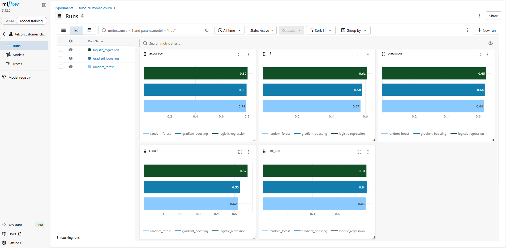
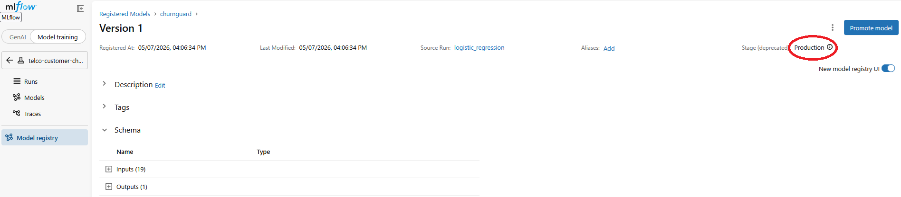

<h1>DESSAUX_Damien_ECF5</h1>

ECF5 de la formation Développeur Concepteur en Science des Donnée de M2i.

- [Contexte](#contexte)
- [Structure](#structure)
- [Prérequis](#prérequis)
- [Stack Technique](#stack-technique)
- [Installation](#installation)
  - [1. Cloner le projet](#1-cloner-le-projet)
  - [2. Configurer l’environnement](#2-configurer-lenvironnement)
  - [3. Lancer la stack](#3-lancer-la-stack)
    - [Stack complète](#stack-complète)
    - [Lancement local](#lancement-local)
      - [1. Télécharger les dépendances](#1-télécharger-les-dépendances)
      - [2. Lancer un serveur MLflow local.](#2-lancer-un-serveur-mlflow-local)
      - [3. Lancer la pipeline ML](#3-lancer-la-pipeline-ml)
      - [4. Lancer l'API](#4-lancer-lapi)
- [Service API](#service-api)
  - [Healthcheck](#healthcheck)
  - [Prediction](#prediction)
  - [Prediction Batch](#prediction-batch)
- [Docker](#docker)
  - [API image (GHCR)](#api-image-ghcr)
  - [Pull](#pull)
  - [Run API](#run-api)
- [CI/CD](#cicd)
  - [CI (push / PR)](#ci-push--pr)
  - [CD (tag vX.Y.Z)](#cd-tag-vxyz)

# Contexte

L'objectif principale du projet est de transformer un prototype notebook en une plateforme MLOps reproductible, testée et déployable.
Ce projet ne concerne pas la data science, l’objectif est exclusivement l'industrialisation des modèles.

Le projet vise l'optention d'un système :
- versionné (MLflow Registry)
- reproductible (Docker + uv)
- testable (pytest + CI)
- déployable (FastAPI)
- industrialisable (CI/CD + GHCR)

# Structure

```txt
DESSAUX_Damien_ECF5/
├── .dockerignore
├── .env.example
├── .gitignore
├── .pre-commit-config.yaml
├── .python-version
├── docker-compose.yaml
├── Dockerfile.api
├── Dockerfile.trainer
├── pyproject.toml
├── README.md
├── run_api.py
├── run_train.py
├── uv.lock
│
├── api/                # API FastAPI (serving)
│   ├── main.py
│   ├── model_loader.py
│   ├── schemas.py
│   ├── settings.py
│   └── __init__.py
│
├── churnguard/         # ML pipeline (training)
│   ├── data.py
│   ├── evaluate.py
│   ├── pipeline.py
│   ├── train.py
│   └── __init__.py
│
├── data/               # Dataset Telco churn
│   └── telco_churn.csv
│
├── docs/               # Graphiques MLflow
│   ├── 1_5_model_comparison.png
│   └── 1_5_model_stage_production.png
│
└── tests/              # Tests unitaires pour churnguard uniquement
    ├── test_data.py
    ├── test_evaluate.py
    ├── test_train.py
    └── __init__.py
```

# Prérequis

- Git
- uv
- Docker

# Stack Technique

- Python 3.11
- scikit-learn
- MLflow (tracking + registry)
- FastAPI
- Pydantic
- Docker / Docker Compose
- uv (gestion dépendances)
- GitHub Actions (CI/CD)
- Trivy (security scan)

# Installation

## 1. Cloner le projet

```bash
git clone https://github.com/DamienDESSAUX-M2i/DESSAUX_Damien_ECF5.git
cd DESSAUX_Damien_ECF5
```

## 2. Configurer l’environnement

```bash
cp .env.example .env
```

## 3. Lancer la stack

### Stack complète

```bash
docker compose up -d --build
```

### Lancement local

#### 1. Télécharger les dépendances

```bash
uv sync
```

#### 2. Lancer un serveur MLflow local.

Le tracking MLflow permet le suivi des runs, la comparaison de modèles et un registry centralisé.

```bash
mlflow server --host 127.0.0.1 --port 5000 --backend-store-uri sqlite:///mlflow.db --default-artifact-root ./mlruns
```
**UI :** http://localhost:5000



#### 3. Lancer la pipeline ML


Le script `run_train.py` permet d'entraîner trois modèles : `LogisticRegression`, `RandomForestClassifier` et `GradientBoostingClassifier`.
Les paramètres du modèle et les métriques sur jeu de test (Accuracy, Precision, Recall F1, ROC-AUC) sont enregistrés dans MLflow.
Le modèle entrainé est enregistré dans un registry MLflow (churnguard) et est automatiquement promu au stage `Staging` ou `Production` s'il a le meilleur score F1.

Le lancement de la script `run_train.py` nécessite l'argument `--model`. Les options de lancement sont décrites dans le tableau ce-après.

| Argument | Description |
| :- | :- |
| `lr` | Modèle LogisticRegression |
| `rf` | Modèle RandomForestClassifier |
| `gb` | Modèle GradientBoostingClassifier |
| `all` | Tous les modèles |

```bash
uv run ./run_train.py --model rf
```



#### 4. Lancer l'API

```bash
uv run ./run_api.py
```

**Entrypoint :** http://localhost:8000/docs

# Service API

## Healthcheck

```bash
curl http://localhost:8000/health
```

**Réponse :**

```JSON
{
  "status": "healthy",
  "model": "churnguard",
  "version": 1
}
```

## Prediction

```bash
curl -X POST http://localhost:8000/predict \
  -H "Content-Type: application/json" \
  -d '{
    "instances": [
      {
        "gender": "Male",
        "SeniorCitizen": 0,
        "Partner": "Yes",
        "Dependents": "No",
        "tenure": 12,
        "PhoneService": "Yes",
        "MultipleLines": "No",
        "InternetService": "Fiber optic",
        "OnlineSecurity": "No",
        "OnlineBackup": "Yes",
        "DeviceProtection": "No",
        "TechSupport": "No",
        "StreamingTV": "Yes",
        "StreamingMovies": "No",
        "Contract": "Month-to-month",
        "PaperlessBilling": "Yes",
        "PaymentMethod": "Electronic check",
        "MonthlyCharges": 70.5,
        "TotalCharges": 845.0
      }
    ]
  }'
```

**Réponse :**

```JSON
{
  "churns": [true],
  "probabilities": [0.82]
}
```

## Prediction Batch

```bash
curl -X POST http://localhost:8000/predict \
  -H "Content-Type: application/json" \
  -d '{
    "instances": [
      {
        "gender": "Male",
        "SeniorCitizen": 0,
        "Partner": "Yes",
        "Dependents": "No",
        "tenure": 12,
        "PhoneService": "Yes",
        "MultipleLines": "No",
        "InternetService": "Fiber optic",
        "OnlineSecurity": "No",
        "OnlineBackup": "Yes",
        "DeviceProtection": "No",
        "TechSupport": "No",
        "StreamingTV": "Yes",
        "StreamingMovies": "No",
        "Contract": "Month-to-month",
        "PaperlessBilling": "Yes",
        "PaymentMethod": "Electronic check",
        "MonthlyCharges": 70.5,
        "TotalCharges": 845.0
      }
    ]
  }'
```

**Réponse :**

```JSON
{
  "churns": [true],
  "probabilities": [0.82]
}
```

# Docker

## API image (GHCR)

```txt
ghcr.io/damiendessaux-m2i/dessaux_damien_ecf5
```

## Pull

```bash
docker pull ghcr.io/damiendessaux-m2i/dessaux_damien_ecf5:latest
```

## Run API

```bash
docker run -p 8000:8000 \
  -e MLFLOW_TRACKING_URI=http://host.docker.internal:5000 \
  ghcr.io/damiendessaux-m2i/dessaux_damien_ecf5:latest
```

# CI/CD

## CI (push / PR)

- validation qualité code
  - Ruff (lint + format)
  - MyPy (typing strict)
- tests automatiques
  - Pytest + coverage ≥ 50%
- build image Docker
  - Scan sécurité Trivy

## CD (tag vX.Y.Z)

- build image production
- push GHCR